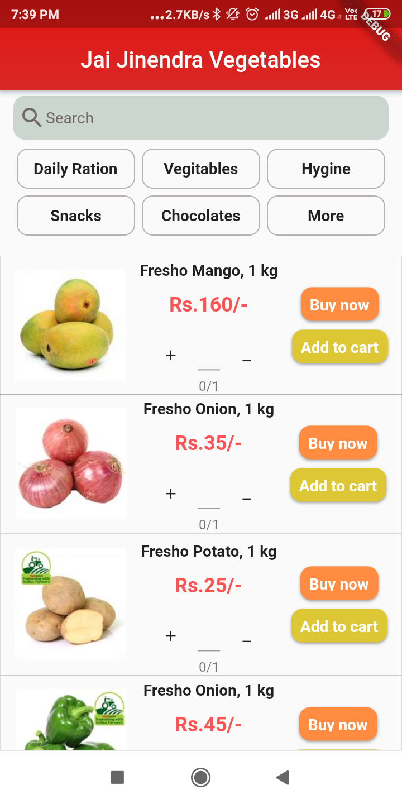
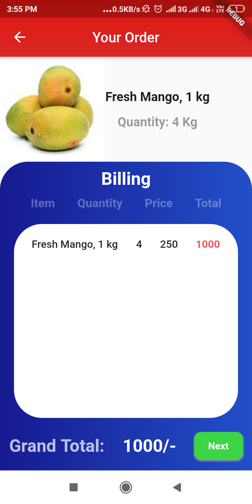
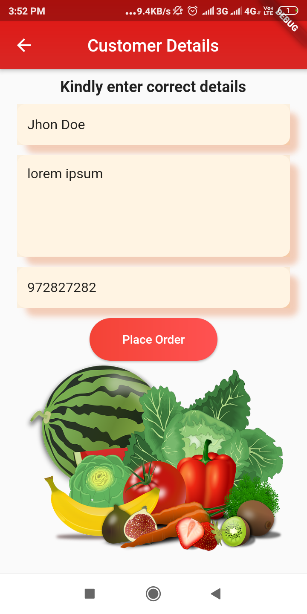
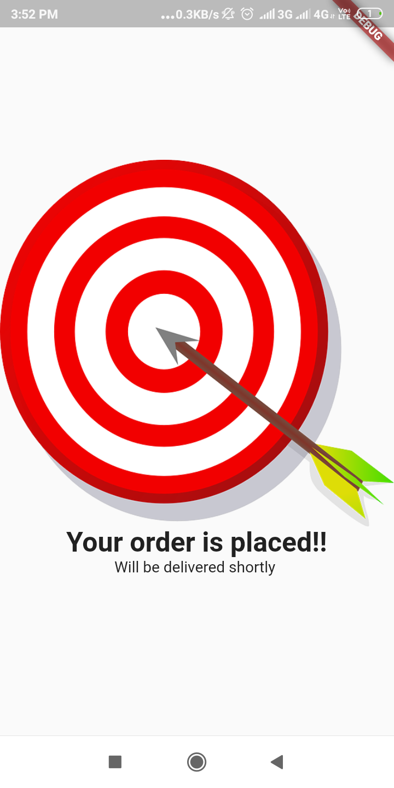

# kirana_app
An application designed to take every local grocery store online.
 <h3>Frontend</h3>
 &nbsp&nbspFlutter Framework with dart.
 <h3>Backend</h3>
    &nbsp&nbspCloud firestore/ Firebase.
    
   # UI Design   
  
  <h3>First Page</h3>
   
   
  <h3>Order Page</h3> 
 

  <h3>Customer Details Page</h3> 
 
 
   <h3>Order Placed Page</h3> 
 
